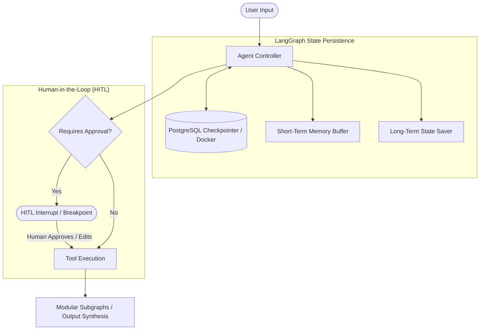

# LLM-with-Memory: State Persistence & Human-in-the-Loop Agent Workflows

A practical repository demonstrating conversational memory patterns, state checkpointer persistence with **PostgreSQL**, **Human-in-the-Loop (HITL)** agent interrupts, and nested subgraph architectures built with **LangGraph**.

---

## Overview

This repository demonstrates the core state persistence and agent control patterns required for production-ready AI systems:

1. **Short-Term Memory (STM):** Managing multi-turn conversation windows and context injection within single threads.
2. **Long-Term Memory (LTM) & Persistence:** Durable session checkpointers using PostgreSQL (`AsyncPostgresSaver`) running in Docker.
3. **Human-in-the-Loop (HITL):** Breakpoints, approval steps, state modification, and human overrides before tool execution.
4. **Modular Subgraphs:** Assembling modular subgraphs inside parent agent nodes for complex business processes.

---

## Architecture Patterns



---

## Key Modules & Notebooks

| File / Notebook | Focus Area | Description |
| :--- | :--- | :--- |
| `15_hitl_agent.py` / `14_hitl.ipynb` | Human-in-the-Loop | Implements breakpoint interruptions and human state modification before executing sensitive operations. |
| `ltm_postgresql.ipynb` | Long-Term Memory | Connects LangGraph to a persistent PostgreSQL backend for cross-session state durability. |
| `stm_pressistence.ipynb` | Short-Term Memory | Demonstrates conversational memory management and state channel reducers. |
| `16_subgraph_in_a_node.py` | Subgraphs | Executes isolated child subgraphs inside a parent node function. |
| `17_subgraph_as_a_node.py` | Subgraphs | Mounts pre-compiled subgraphs directly as first-class nodes in a parent `StateGraph`. |
| `docker-compose.yml` | Infrastructure | Local containerized PostgreSQL instance for checkpointer storage. |

---

## Tech Stack

- **Framework:** LangGraph, LangChain Core, LangChain Community
- **Database & Persistence:** PostgreSQL, Docker Compose, `psycopg`
- **LLM Integrations:** OpenAI, Groq, Google Gemini

---

## Getting Started

### 1. Prerequisites
- Python 3.10+
- Docker & Docker Compose (for PostgreSQL checkpointer)

### 2. Installation

```bash
git clone https://github.com/Ayyan119/LLM-with-Memory.git
cd LLM-with-Memory

python3 -m venv .venv
source .venv/bin/activate
pip install -r requirements.txt
```

### 3. Start PostgreSQL Checkpointer

```bash
docker compose up -d
```

### 4. Running the Examples

```bash
# Run the Human-in-the-Loop agent demonstration
python 15_hitl_agent.py

# Run Subgraph compositions
python 16_subgraph_in_a_node.py
python 17_subgraph_as_a_node.py
```

---

## License

MIT License.
